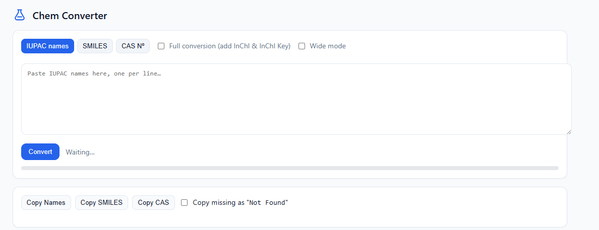
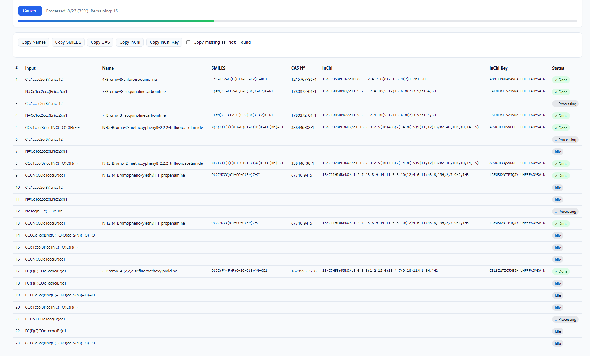

# Chem Converter

> A  chemical identifier resolution tool integrating IUPAC, SMILES, CAS RN, and InChI conversions.


**Chem Converter** is a robust web application and API designed to bridge the gap between various chemical naming conventions and structural representations. It aggregates data from the CAS (Chemical Abstracts Service) API and CIRpy (Chemical Identifier Resolver) to provide accurate, stereo-aware conversions.

- **Key Capabilities**:
  - **Multi-Format Resolution**: Convert between IUPAC names, SMILES, CAS Registry Numbers, and InChI strings.
  - **Stereochemistry Support**: Preserves stereochemical information during IUPAC to SMILES conversion using `rdkit` and InChI-first resolution.
  - **Metadata Enrichment**: Automatically retrieves Molecular Weight (MW) and Molecular Formula (MF).
  - **Batch Processing**: Web interface supports bulk conversion of chemical lists.

## Quickstart

This application is container-ready but can also be run in a local Python environment.

### Prerequisites

- Python 3.10 or higher
- Access to CAS API credentials (see Configuration)

### Local Installation

```bash
# 1. Clone the repository
git clone https://github.com/oriolvillalavela-dot/chem_converter.git
cd chem_converter

# 2. Create a virtual environment
python -m venv venv
source venv/bin/activate  # On Windows: venv\Scripts\activate

# 3. Install dependencies
pip install -r requirements.txt

# 4. Configure environment
cp .env.example .env  # You must create this file (see Configuration)
```

### Running the Application

```bash
python app.py
```

The application will start at `http://0.0.0.0:8000`.
- **Web UI**: Visit `http://localhost:8000/`
- **API Documentation**: Visit `http://localhost:8000/docs`

## Reproducibility

```bash
git checkout v1.0-thesis
```

## Configuration

The application requires specific environment variables to authenticate with the CAS API. Create a `.env` file in the root directory:

| Variable | Required | Default | Description |
| :--- | :---: | :--- | :--- |
| `CAS_SERVER` | Yes | - | Base URL for CAS API integration |
| `CAS_TOKEN_URL` | Yes | - | OAuth2 token endpoint |
| `CAS_CLIENT_ID` | Yes | - | CAS Client ID |
| `CAS_CLIENT_SECRET` | Yes | - | CAS Client Secret |
| `CAS_SCOPE` | No | `cas_content` | OAuth2 Scope |
| `CAS_VERIFY_SSL` | No | `true` | Verify SSL certificates |
| `CAS_DEBUG` | No | `0` | Enable detailed debug logging |
| `PORT` | No | `8000` | Server port |

## Usage Examples

### 1. Web Interface
Navigate to the home page to use the interactive dashboard. You can paste a list of IUPAC names, select "Full conversion", and export the results including InChIKeys and CAS numbers.

### 2. API: Resolve Chemical
You can programmatically resolve chemicals using the REST API.

**Request (cURL):**
```bash
curl -X 'POST' \
  'http://localhost:8000/resolve' \
  -H 'Content-Type: application/json' \
  -d '{
  "inputType": "iupac",
  "value": "aspirin",
  "fullConversion": true
}'
```

**Response:**
```json
{
  "input": "aspirin",
  "name": "Acetylsalicylic acid",
  "smiles": "CC(=O)Oc1ccccc1C(O)=O",
  "cas": "50-78-2",
  "inchi": "InChI=1S/C9H8O4/c1-5(10)13-8-6-3-2-4-7(8)9(11)12/h2-4,6H,1H3,(H,11,12)",
  "inchikey": "BSYNRYMUTXBXSQ-UHFFFAOYSA-N"
}
```

## Screenshots

> *Add screenshots of the Web UI here.*

| Dashboard View | Batch Conversion |
| :---: | :---: |
|  |  |

## Project Structure

```text
chem_converter/
├── app.py                 # Main FastAPI application entry point
├── cas_client.py          # Client for CAS API with authentication & rate limiting
├── converters.py          # Core logic for IUPAC -> SMILES/InChI conversion
├── requirements.txt       # Python dependencies
├── manifest.json          # Deployment configuration (RStudio Connect)
├── static/                # Frontend assets (HTML, CSS, JS)
│   ├── index.html         # Main Web UI
│   └── app.js             # Frontend logic
└── test_rate_limit.py     # Verification script for API rate limiting
```

## Security and License

### Security
This repository **does not** contain any API keys or secrets. All credentials must be provided via the `.env` file. 

## Author

**Oriol Villa**  
*Roche /*  